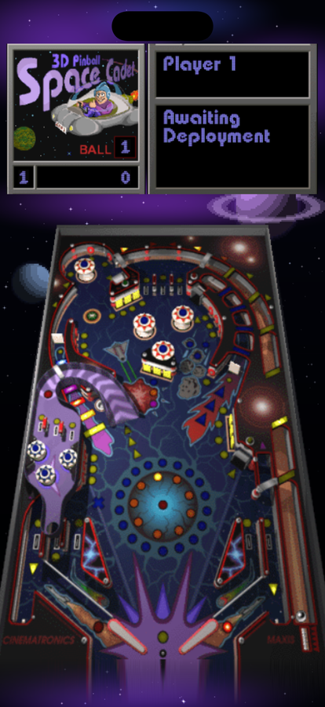
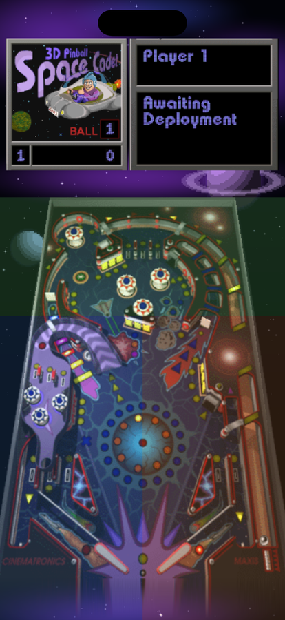
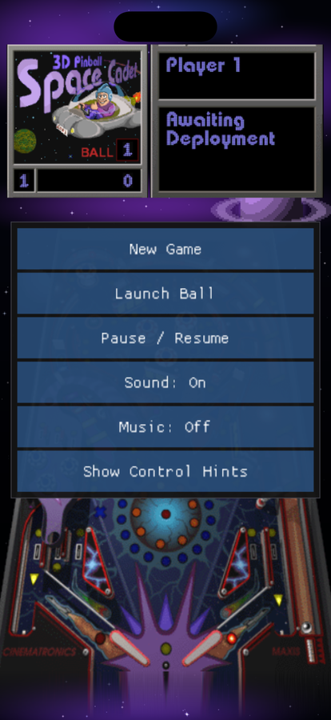

# How to play

The screen is split into two parts:

- **Top** — the scoreboard. Left tile shows the logo and current ball; right tile
  shows the player and mission messages.
- **Below** — the playfield.

## Controls

The whole screen is touch. There are no on-screen buttons to hit — you tap
*regions*, so you never have to look away from the ball.

| Region | Action |
| --- | --- |
| **Scoreboard** (top) | No game input. Tap the **logo tile** to open the menu. |
| **Upper table** (green) | **Plunger.** Hold to pull back, release to launch. |
| **Lower left** (blue) | **Left flipper** |
| **Lower right** (orange) | **Right flipper** |

Turn these hints on or off any time from the menu → **Show / Hide Control Hints**.

### Flippers

Just tap — a tap is a full flip. The flippers are on/off with fixed strength, so
tapping harder or longer does not hit harder. You can:

- **Hold** a flipper to keep it raised and trap the ball (useful for aiming).
- **Press both at once** — multitouch is supported.

Anywhere in the lower half works, so you can rest your thumbs at the screen edges.

### Plunger

Touch and **hold** in the upper table area, then release. Longer hold = harder
launch. A quick flick barely moves the ball, so hold for about a second for a full
launch.

## Menu

Tap the **logo tile** (top left of the scoreboard) to open it.

| Item | What it does |
| --- | --- |
| **New Game** | Restart from ball 1 |
| **Launch Ball** | Deploy the ball without using the plunger |
| **Pause / Resume** | Freeze the table |
| **Sound** | Sound effects on/off |
| **Music** | Music on/off (currently silent — see below) |
| **Show / Hide Control Hints** | Toggle the coloured zone overlay |

Tap anywhere outside the menu to close it.

## Scoring and high scores

You get **3 balls**. Hit mission targets to select and complete missions — the
right-hand panel tells you what to do next.

When all three balls drain, if you made the top 5 the high score dialog opens and
the on-screen keyboard appears. Type a name and tap **OK**.

Scores are saved immediately and survive quitting the app.

## Notes

- **Portrait only.**
- **Nudging is not available yet** — you cannot bump the table to save a ball.
- **Music is silent** — sound effects work; the MIDI soundtrack has no instrument
  set bundled.
- The app fully saves its state when you background it, so switching apps mid-game
  is safe.
